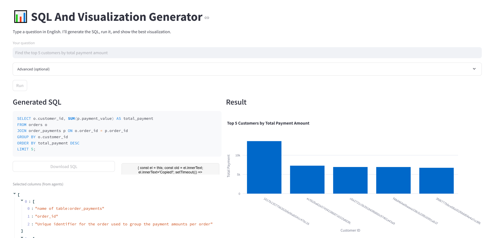

# SQL & Visualization Agent (Streamlit)

Generate SQL from natural language, execute on MySQL, and render the best visualization automatically (Plotly) using LangChain/LangGraph + Azure OpenAI.

---

## Screenshot



---

## Quickstart

```bash
# 1) Create & activate a virtual environment
python -m venv .venv
# Windows (Git Bash)
source .venv/Scripts/activate
# Windows (PowerShell) alternative:
# .\.venv\Scripts\Activate.ps1
# macOS/Linux:
# source .venv/bin/activate
